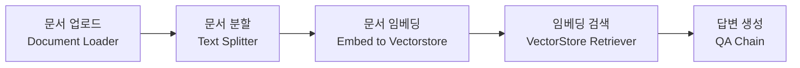

# LangChain

## 1. ChatGPT

> OpenAI가 개발한 프로토타입 대화형 인공지능 챗봇이다. ChatGPT는 대형 언어 모델 GPT-3의 개선판인 GPT-3.5를 기반으로 만들어졌으며, 지도학습과 강화학습을 모두 사용해 파인 튜닝되었다. (wiki)

### 1.1. ChatGPT의 한계

#### 정보 접근 제한

- ChatGPT(GPT-3.5)는 2021.9월까지의 데이터를 학습한 LLM이므로, 2022부터의 정보에 대해서는 답변을 하지 못하거나, 거짓된 답변을 제공한다.
- Vectorstore 기반 정보 탐색 or Agent 활용한 검색 결합

#### 토큰 제한

- ChatGPT에서 제공하는 모델인 GPT-3.5와 GPT-4는 각각 4096, 8192 토큰이라는 입력 토큰 제한이 존재한다.

#### 환각 현상(Hallucination)

- 사실에 대한 질문을 했을 때, 엉뚱한 대답을 하거나 사실인척 거짓말을 하는 경우가 많다.

### 1.2. ChatGPT 개량 방법론

#### Fine-tuning

- 사전에 훈련된 기존 딥러닝 모델의 weight를 조정하여 원하는 용도의 모델로 업데이트하는 방식.

- 학습에 필요한 GPU, 학습 시간 등 리소스 비용이 많이 드는 고비용 방법론

#### N-shot Learning

- 0 ~ N의 출력 예시를 제시하여, 딥러닝이 용도에 알맞은 출력을 하도록 조정하는 방식

#### In-context Learning (LangChain Method)

- 문맥(정보)을 제시하고, 이 문맥 기반으로 모델이 출력하도록 조정하는 방식.

## 2. LangChain 개념과 원리

> LangChain은 언어 모델로 구동되는 애플리케이션을 개발하기 위한 프레임워크이다. (LangChain 공식문서)
>
> - 데이터 인식 기능 : 언어 모델을 다른 데이터 소스에 연결하는 기능
>
> - 에이전트 기능 : 인터넷을 통해 언어 모델이 환경과 상호 작용하는 기능

### 2.1. LangChain 기능

LangChain이 제공하는 기능들을 활용하여 ChatGPT의 한계를 극복한 애플리케이션을 개발할 수 있다.

1. 정보 접근 제한 >> **Vectorstore** 기반 정보 탐색 or **Agent** 활용한 검색 결합
2. 토큰 제한 >> **TextSplitter**를 활용한 문서 분할
3. 환각 현상 >> 주어진 문서에 대해서만 답하도록 Prompt 입력

## 3. LangChain의 핵심 구성요소

### 3.1. LLM

초거대 언어모델로, 생성 모델의 엔진과 같은 역할을 하는 핵심 구성 요소 (ex. GPT-3.5, GPT-4, LLaMA, MPT, ...)

### 3.2. Prompts

초거대 언어모델에게 지시하는 명령문

- Prompt Templates : 명령문을 쉽게 입력할 수 있도록 도와주는 템플릿
- Chat Prompt Template : 채팅모델을 위한 템플릿
- Example Selectors : 몇개의 예시를 통해서 원하는 답변을 얻을 수 있게 함
- Output Parsers : 원하는 형식으로만 대답을 할 수 있도록 함

### 3.3. Index

- LLM이 문서를 쉽게 탐색할 수 있도록 구조화하는 모듈
- Document Loaders, Text Splitters, Vectorstores, Retrievers, ...

### 3.4. Memory

- 채팅 이력을 기억하도록 하여, 이를 기반으로 대화가 가능하도록 하는 모듈
- ConversationBufferMemory, Entity Memory, Conversation Knowledge Graph Memory, ...

### 3.5. Chain

- LLM 사슬을 형성하여 연속적인 LLM 호출이 가능하도록 하는 핵심 구성 요소

- 프롬프트 출력을 또 다른 프롬프트의 입력으로 받게하여 프롬프트들을 연결하고 원하는 답변을 잘 받을 수 있도록 하는 기능
- LLM Chain, Question Answering, Summarization, Retrieval Question/Answering, ...

### 3.6. Agents

- LLM이 기존 Prompt Template으로 수행할 수 없는 작업을 가능하게 하는 모듈
- 웹 검색을 가능하게 하거나 SQL 쿼리를 통해 정보를 추출하게 할 수 있다.
- Custom Agent, Custom MultiAction Agent, Conversation Agent, ...

## 4. PDF문서 챗봇 구축 예시

## References

1. 유튜브 모두의AI - 'Langchain 강의 (1/n) - Langchain이 뭘까?'